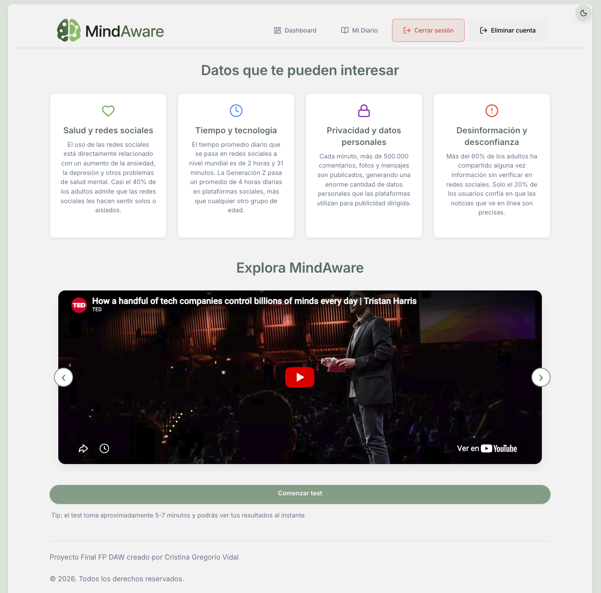
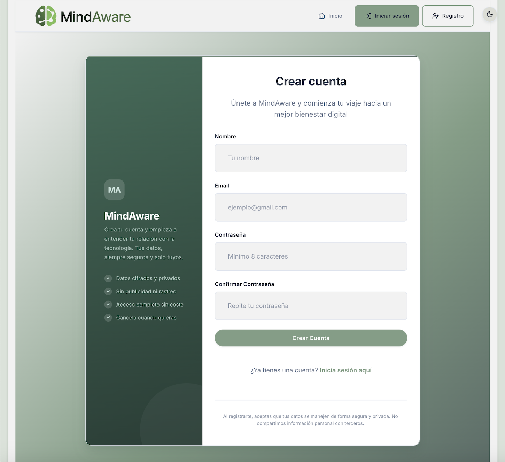
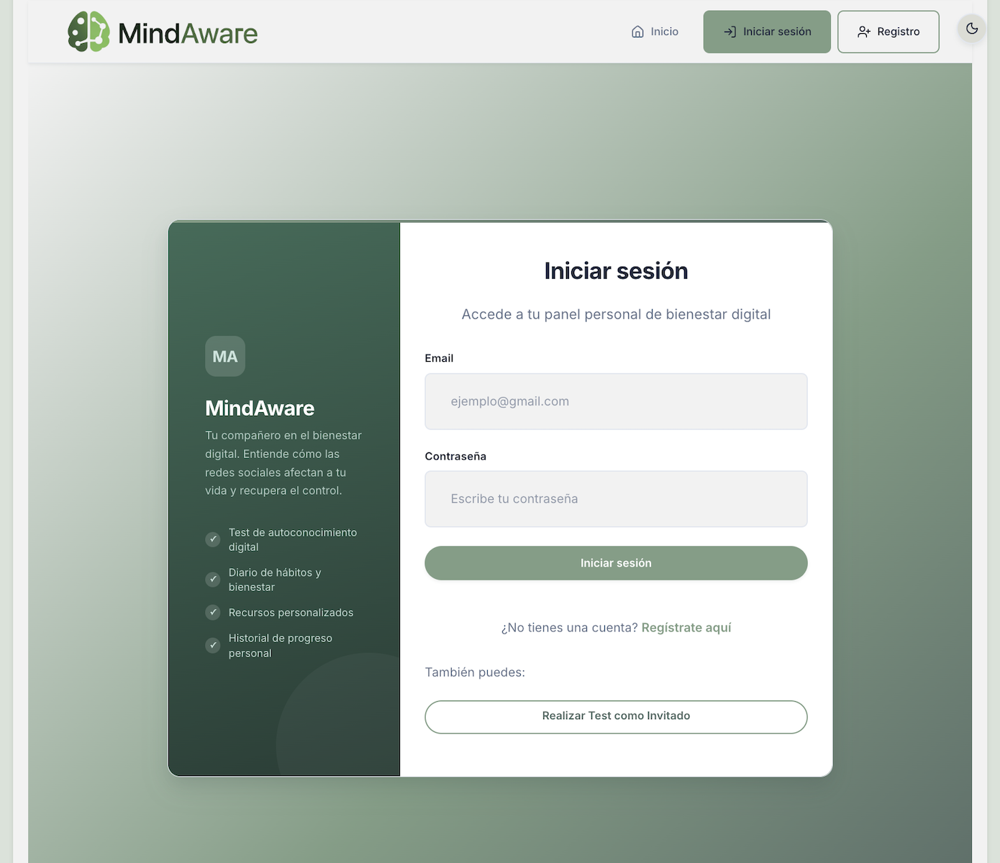
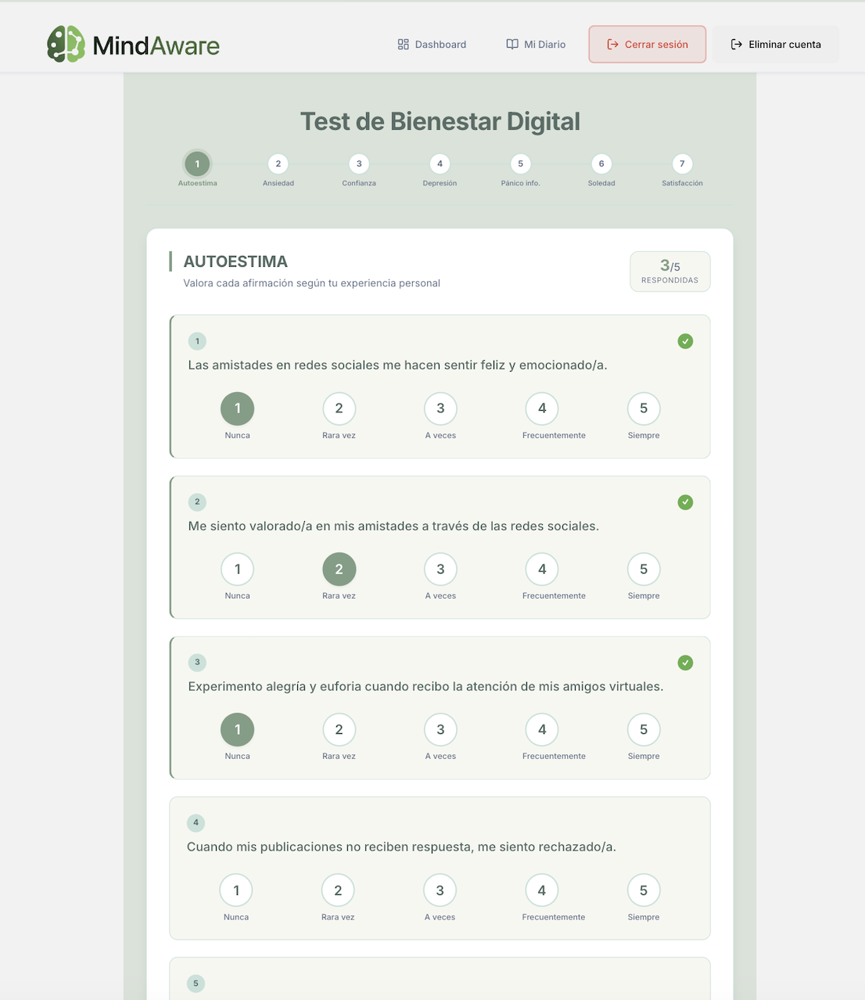
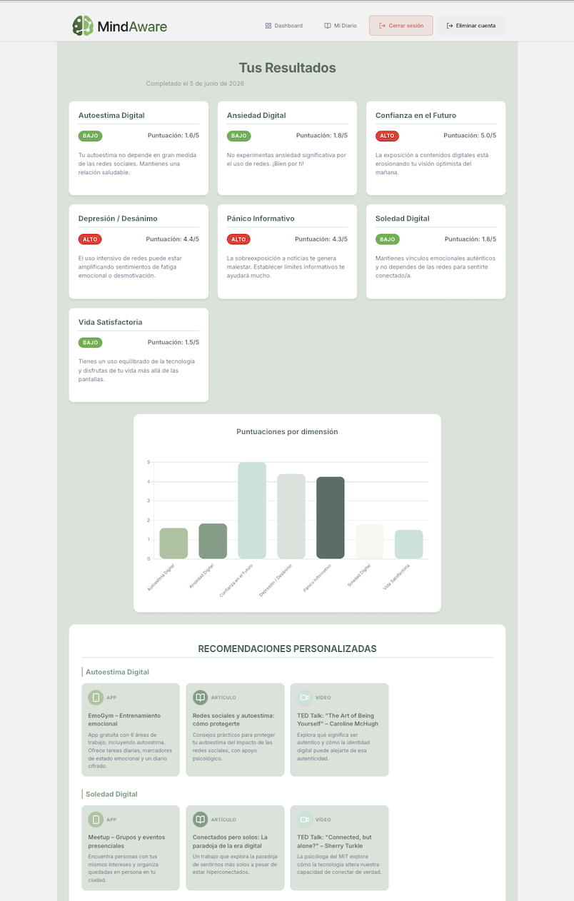
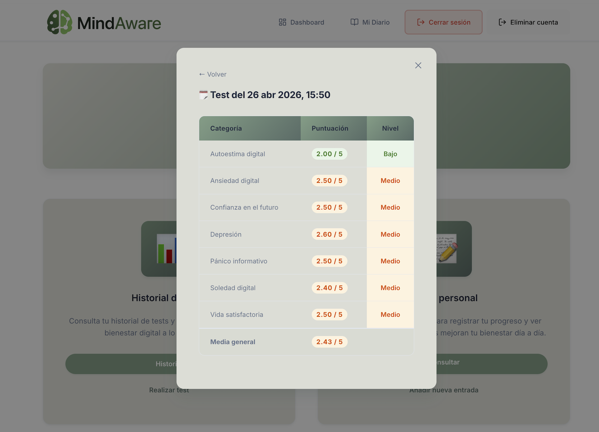
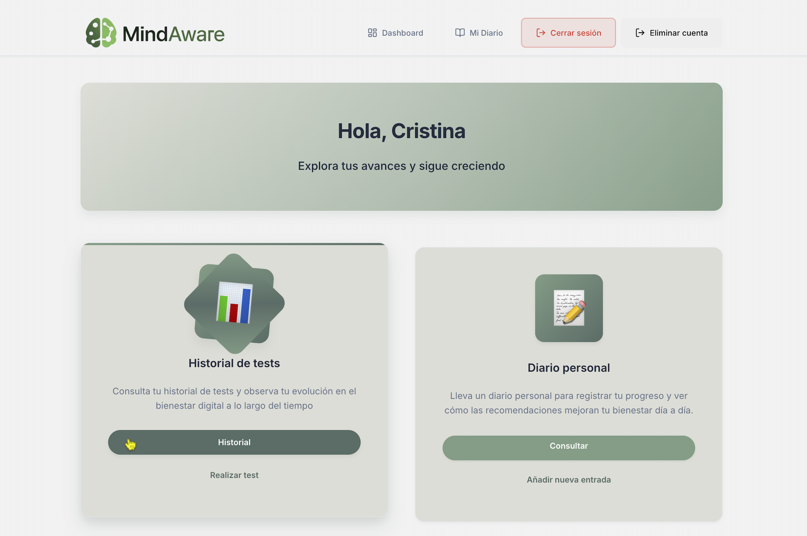
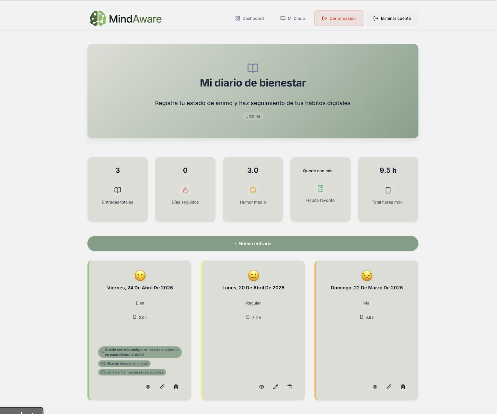

# MINDAWARE - Digital Wellness Application

## 📋 Description

MINDAWARE is a web application focused on digital wellness that helps users understand and improve their relationship with technology and social media. The tool uses an interactive 35-question questionnaire that evaluates different dimensions of digital wellbeing using a Likert scale.

**Final Project**: This application is the capstone project for the Higher Vocational Education Diploma in Web Application Development (Grado Superior de Formación Profesional en Desarrollo de Aplicaciones Web).

## 🎯 Main Features

- **Comprehensive Assessment**: A 35-question test that analyzes 7 psychological dimensions
- **Data Visualization**: Dynamic charts to display results
- **Personalized Recommendations**: Suggestions based on user results
- **Progress History**: Tracking evolution over time
- **User Authentication**: Complete registration and login system
- **Responsive Design**: Adaptive design for all devices

## 📸 Screenshots











## 🧠 Evaluated Dimensions

1. **Digital Self-Esteem**: Perception of personal value influenced by social media
2. **Digital Loneliness**: Feeling of emotional disconnection despite being connected
3. **Digital Anxiety**: Nervousness related to notifications and FOMO
4. **Discouragement/Depression**: Usage patterns affecting mood
5. **Information Panic**: Saturation from excessive information
6. **Life Satisfaction**: Balance between digital and personal life
7. **Confidence in the Future**: Optimistic perspective on the future

## 🛠️ Technologies Used

### Frontend
- **React 19** - JavaScript library for user interfaces
- **TypeScript** - Static typing for JavaScript
- **Vite** - Fast development tool
- **React Router DOM** - Client-side navigation
- **Chart.js + React-ChartJS-2** - Data visualization
- **CSS3** - Modern styles with CSS variables

### Backend
- **Node.js** - JavaScript runtime environment
- **Express.js** - Web framework for Node.js
- **Supabase** - Cloud database and authentication
- **CORS** - Cross-Origin Resource Sharing handling
- **dotenv** - Environment variables

## 📁 Project Structure

```
/
├── backend/                 # Express server
│   ├── server.js           # Server entry point
│   ├── package.json        # Backend dependencies
│   ├── .env.example        # Example environment variables
│   └── routes/             # API routes (future expansions)
│
├── frontend/               # React application
│   ├── src/
│   │   ├── components/     # Reusable components
│   │   │   ├── Navigation.tsx
│   │   │   └── Navigation.css
│   │   ├── pages/          # Application pages
│   │   │   ├── Home.tsx
│   │   │   ├── Test.tsx
│   │   │   ├── Results.tsx
│   │   │   ├── Dashboard.tsx
│   │   │   ├── Login.tsx
│   │   │   ├── Register.tsx
│   │   │   ├── Recommendations.tsx
│   │   │   └── *.css       # Page styles
│   │   ├── data/
│   │   │   └── testQuestions.ts  # Questionnaire questions
│   │   ├── utils/
│   │   │   └── supabase.ts       # Supabase configuration
│   │   ├── App.tsx         # Main component
│   │   └── main.tsx        # Entry point
│   ├── package.json        # Frontend dependencies
│   ├── vite.config.ts      # Vite configuration
│   └── tsconfig.*.json     # TypeScript configuration
└── README.md               # Project documentation
```

## 🚀 Installation and Setup

### Prerequisites
- Node.js (version 18 or higher)
- npm or yarn

### Installation

1. **Clone the repository**:
   ```bash
   git clone https://github.com/cristinagregorio06/MindAware.git
   cd MindAware
   ```

2. **Install backend dependencies**:
   ```bash
   cd backend
   npm install
   ```

3. **Install frontend dependencies**:
   ```bash
   cd ../frontend
   npm install
   ```

4. **Run the application**:
   ```bash
   npm run dev
   ```
   
   > ⚠️ **Important**: You must install all dependencies first. Without them, `npm run dev` won't work. The `node_modules` folder is not included in the repository—it's generated by `npm install` using the information in `package.json`.

## 🎮 Application Usage

### 1. Development

To run the application in development mode:

```bash
# Terminal 1: Start the backend
cd backend
npm run dev

# Terminal 2: Start the frontend
cd frontend
npm run dev
```

The application will be available at:
- Frontend: `http://localhost:5173`
- Backend API: `http://localhost:3001`

### 2. Production Build

```bash
# Build the frontend
cd frontend
npm run build

# The backend can be run directly with:
cd backend
npm start
```

## 📱 Features

### For Guest Users
- Take the complete digital wellness test
- View immediate results with charts
- Access general recommendations
- Explore resources and tools

### For Registered Users
- All guest features
- Save test history
- View progress over time
- Personal tracking dashboard
- Historical results comparison

### Main Pages

1. **Home** (`/`): Main page with application information
2. **Test** (`/test`): Interactive 35-question questionnaire
3. **Results** (`/results`): Detailed score visualization
4. **Dashboard** (`/dashboard`): Personal area with history (requires login)
5. **Recommendations** (`/recommendations`): Curated resources and tools
6. **Login/Register** (`/login`, `/register`): User authentication

## 🎨 Visual Design

### Color Palette
- **Primary**: #4ECDC4 (Turquoise)
- **Secondary**: #45B7D1 (Sky Blue)
- **Accent**: #FF6B6B (Coral)
- **Success**: #10B981 (Green)
- **Warning**: #F59E0B (Amber)
- **Error**: #EF4444 (Red)

### Typography
- Font Family: Inter, system fonts
- Responsive design with standard breakpoints
- Coherent typographic scaling

## 🔧 Available Scripts

### Frontend
```bash
npm run dev        # Development server
npm run build      # Build for production
npm run preview    # Preview production build
npm run lint       # Run linter
```

### Backend
```bash
npm start          # Start production server
npm run dev        # Development server with nodemon
```

## 📊 Evaluation Methodology

The test uses a 5-point Likert scale:
1. Strongly Disagree
2. Disagree
3. Neither Agree nor Disagree
4. Agree
5. Strongly Agree

### Scoring
- Some questions use reverse scoring
- Scores are averaged by dimension
- Overall score is the average of all dimensions
- Interpretation ranges:
  - **1.0-2.0**: Healthy level (Green)
  - **2.1-3.5**: Attention recommended (Yellow)
  - **3.6-5.0**: Requires attention (Red)


## 📄 License

This project is for educational and research purposes.

## ⚠️ Disclaimer

This application is a self-exploration tool and does not constitute a professional medical diagnosis. If you experience significant difficulties with your digital or mental wellbeing, consider consulting with a healthcare professional.

